# PlantUML Mindmap - Complete Syntax Guide

## 📋 Table of Contents
1. [Basic Syntax](#basic-syntax)
2. [Direction Control](#direction-control)
3. [Colors & Styling](#colors--styling)
4. [Box Types](#box-types)
5. [Multiple Roots](#multiple-roots)
6. [Advanced Styling](#advanced-styling)
7. [Text Formatting](#text-formatting)
8. [Best Practices]

---

## 1. Basic Syntax

### Simple Mindmap Structure
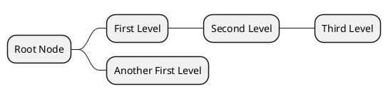

### Alternative Syntax (Plus/Minus)
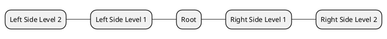

**Key Points:**
- `*` creates nodes (more asterisks = deeper levels)
- `+` for right side, `-` for left side
- Indentation is optional but improves readability

---

## 2. Direction Control

### Default (Left to Right)
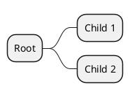

### Top to Bottom
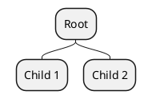

### Right to Left
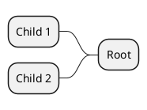

### Mixed Directions
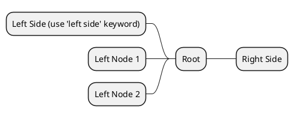

---

## 3. Colors & Styling

### Inline Color Syntax
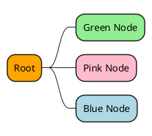

### Using Style Classes
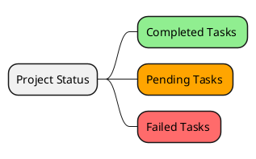

### Style Inheritance
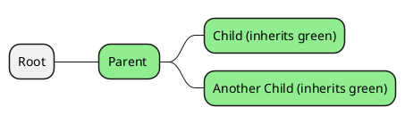

---

## 4. Box Types

### Boxless Nodes (Underscore Suffix)
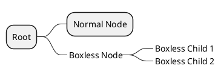

### Mixed Box Types
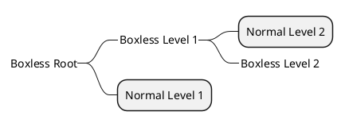

---

## 5. Multiple Roots

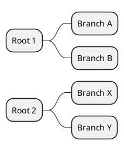

---

## 6. Advanced Styling

### Comprehensive Node Styling
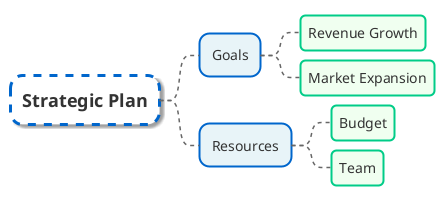

### Depth-Based Styling
```plantuml
@startmindmap
<style>
mindmapDiagram {
    node {
        BackgroundColor lightGreen
    }
    :depth(0) {
        BackgroundColor #FF6B6B
        FontColor white
        FontStyle bold
    }
    :depth(1) {
        BackgroundColor #FFA500
    }
    :depth(2) {
        BackgroundColor #FFD700
    }
}
</style>

* Level 0 (Root)
** Level 1
*** Level 2
**** Level 3
@endmindmap
```

---

## 7. Text Formatting

### Creole Markup
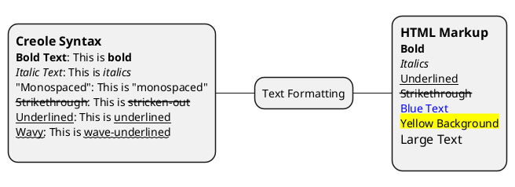

### Lists in Nodes
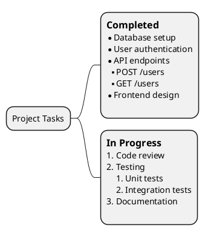

### Icons and Special Characters
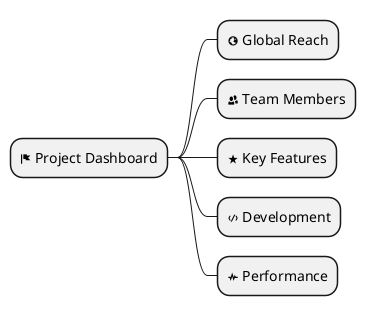

### Multiline Text
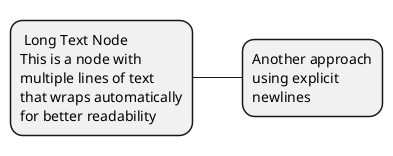

---

## 8. Best Practices

### Complete Example with Headers, Footers, and Legends
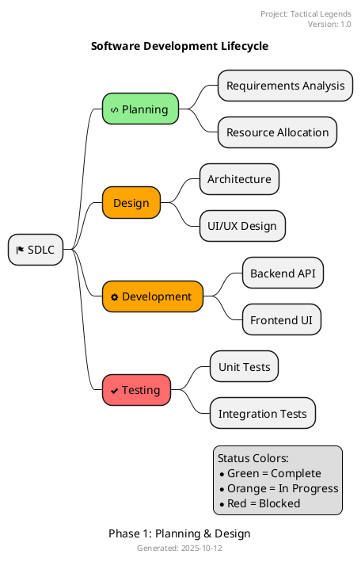

### Tactical Legends Game Architecture Example
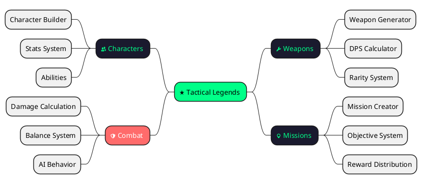

---

## 🎯 Quick Reference

### Syntax Shortcuts
| Symbol | Purpose |
|--------|---------|
| `*` | Create node (increase for depth) |
| `+` | Right-side node |
| `-` | Left-side node |
| `_` suffix | Boxless node |
| `[#color]` | Inline color |
| `<<class>>` | Apply style class |
| `:text;` | Multiline node content |

### Common Colors
- `lightgreen`, `lightblue`, `lightgray`
- `#00FF88` (hex codes)
- `orange`, `red`, `gold`
- RGB: `rgb(255,100,100)`

### Useful Icons (OpenIconic)
- `<&flag>`, `<&star>`, `<&people>`
- `<&code>`, `<&cog>`, `<&shield>`
- `<&map-marker>`, `<&globe>`, `<&pulse>`

---

## 📝 Notes

1. **Performance**: Large mindmaps (100+ nodes) may render slowly
2. **Styling Priority**: Inline colors override style classes
3. **Text Width**: Use `MaximumWidth` to control node width
4. **Line Breaks**: Use `\n` or multiline syntax `:text;`
5. **Compatibility**: Some features require recent PlantUML versions

---

*Generated for Tactical Legends - Game Development Toolkit*
