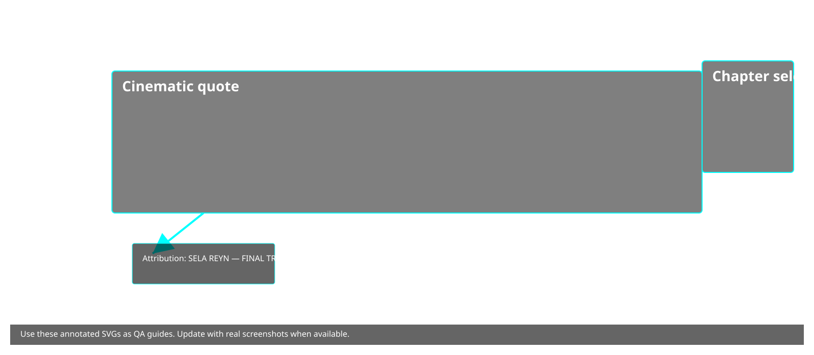
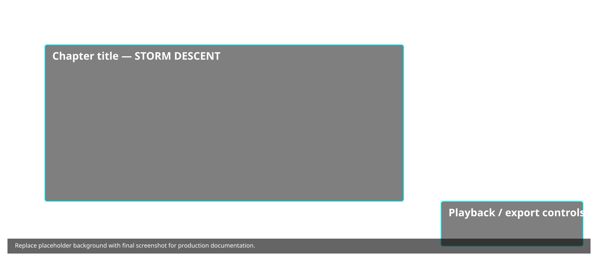

# Preview Builds & Test Tracks

This page explains how to prepare preview builds for testers.

## Hero image
Alt text: "Armored unit with modern gear holding a rifle — unit art used in preview builds."

## Annotated screenshots for preview & QA

### Squad Bay (annotated)


**Transcript (OCR):**

TACTICAL LEGENDS
RISE OF OISTARIAN

Left navigation:
- COMMAND
- SQUAD (highlighted)
- CODEX

Main header:
SQUAD BAY

Card (example):
RIFLEMAN
Trooper-9BF9
Frontline Trooper - 0 kills - 0 ops
HP 10 | AP 2 | MOV 4 | RNG 4
DMG 3-5 • Suppressing Fire
Weapon: TL-Standard Rifle

---

### Cinematic quote (annotated)


**Transcript (OCR):**

"LEGENDS ARE
WRITTEN IN THE SAND —
AND BURIED IN IT.

- SELA REYN - HALCYON-03 - FINAL TRANSMISSION"

Chapter selector: CH-03 // THE VAULT OF EDEN

---

### Chapter title — Storm Descent (annotated)


**Transcript (OCR):**

STORM
DESCENT

— THE SKY BLEEDS
SAND —

Chapter selector: CH-02 // STORM DESCENT

---

## Steps to prepare preview build
1. Update manifest/package name for the preview flavour (if using productFlavors)
2. Increment versionCode and versionName
3. Produce signed AAB and upload to internal testing track
4. Share internal test link with QA

## Screenshots and marketing
- Use store-assets/screenshots/ for preview screenshots
- Use store-assets/feature_graphic.png for temporary feature graphic

## Quick test commands
```bash
# Build (Gradle)
./gradlew bundleRelease
# Install universal apks for local QA
bundletool build-apks --bundle=app-release.aab --output=app.apks --mode=universal
bundletool install-apks --apks=app.apks
```

