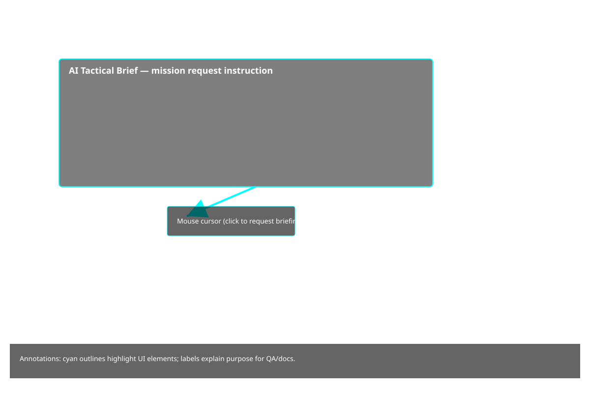

# Production — Tactical Legends

This page contains the production-ready checklist and release notes you should follow before uploading to Google Play (or other stores).

## Hero image
Alt text: "Mysterious cloaked figure in an ancient vault, warm tones — hero art for production listing."

## Annotated screenshot
The annotated screenshot below highlights the UI elements we recommend documenting during production QA.

**Transcript (OCR):**

AI TACTICAL BRIEF

> Select a mission and request a briefing. Command AI will transmit operational intel.

## Production checklist
- Replace package name in store-assets/store-metadata.json with your real package name (e.g., com.yourcompany.tacticallegends)
- Ensure privacy policy URL and contact email are correct
- Add real high-res icon (store-assets/icon_512.png) and feature graphic (store-assets/feature_graphic.png)
- Add at least 4 screenshots in store-assets/screenshots/
- Build and sign .aab and upload to Play Console internal track
- Complete content rating questionnaire and compliance checks

## Release notes template
- Version: 1.0.0
- What’s new: Initial production release — core gameplay, campaign, and multiplayer

## Links
- Store metadata: /store-assets/store-metadata.json
- Build guide: /store-assets/build_and_release.md

